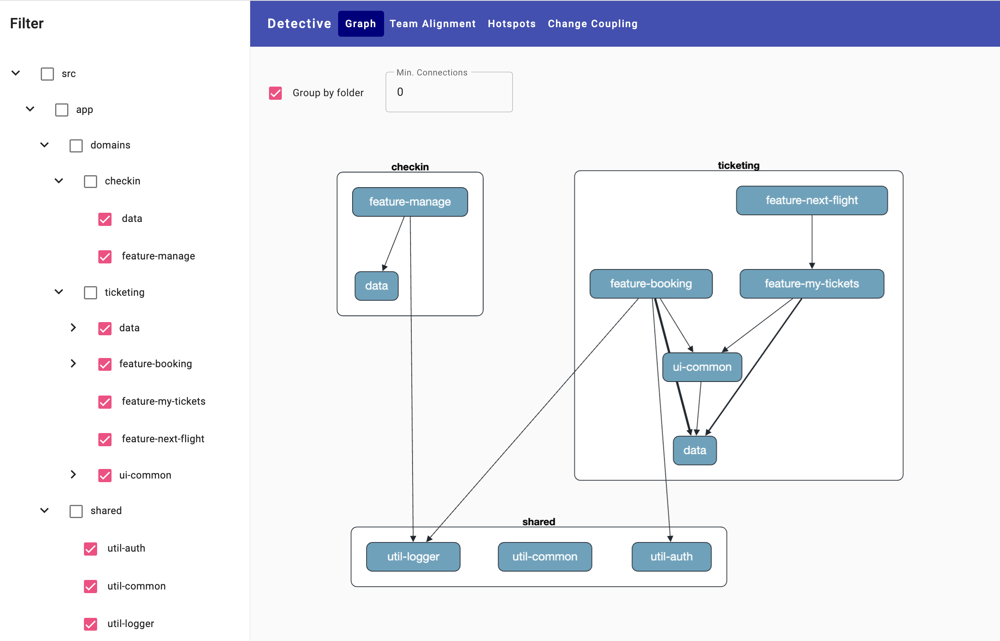
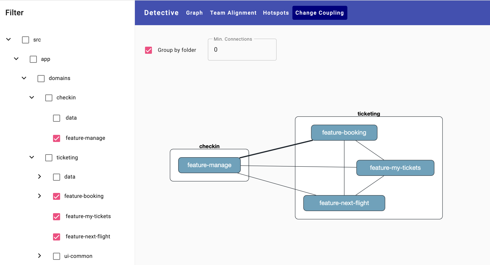
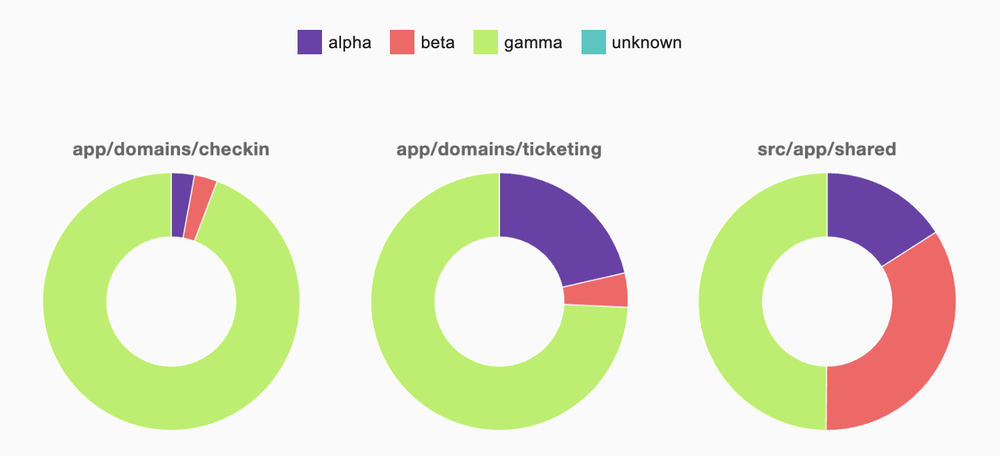

# Detective

Visualize and Analyze your TypeScript-based Architecture!

Detective leverages forensic code analysis at the architectural level to uncover hidden patterns in your codebase.

## Features

### Visualize Your Project Structure

Gain an overview of your modules, domains, and layers:



### Analyze Change Coupling

The Change Coupling analysis reveals which modules have often been changed together, indicating a non-obvious type of coupling.



### Analyze Team/Code Alignment

The Team Alignment Analysis shows whether your team structure and module/domain boundaries are aligned:



### Analyze Hotspots

A Hotspot is a complex file with that was previously changed quite often and hence comes with a higher risk for bugs.


## Using

You can try it out quickly by running Detective in your project's **root** directory:

```shell
npm i @softarc/detective -D
npx detective
```

## Defining Teams

For the Team Alignment Analysis, you need to map team names to the names of your team members as found in `git log`. This is done in the file `.detective/config.json` created the first time detective runs:

```json5
{
  [...]
  "teams": {
    "alpha": ["John Doe", "Jane Doe"],
    "beta": ["Max Muster", "Susi Sorglos"]
  }
  [...]
}
```

## Defining Entrypoints

Detective probes a set of default entry points by looking at files with the names `index.ts` and `main.ts` in several directories. If your project structure is different, you can add this entry with respective globs to your `.detectice/config.json`:

```json5
{
  [...]
  "entries": [
    "packages/*/index.ts"
  ],
  [...]
}
```

## Filtering the Git Log

By default, Detective uses all the entries in the git log and analyzes all `.ts` files. You can change this by filtering log entries out that contain a given string and by defining globs pointing to the files you want to analyze.

In the following example, commit messages containing the substring `prettier formatting` will be skipped and also files ending with `*.spec.ts` are not looked at.

```json5
{
  [...]
  "filter": {
    "logs": [
      "prettier formatting"
    ],
    "files": [
      "**/*.ts",
      "!**/*.spec.ts"
    ]
  },
  [...]
}
```

Please note that excluding tests can help to regarding to your goals. However, there are situations where you also want to analze the coupling between tests and the tested code.

To keep the git log cache small, only the first line of git commit messages, the user name and their email address, the commit hash and the date is respected by the filter.

## Nx Support

Detective works with all TypeScript projects. If it's executed within an [Nx](https://nx.dev/) project, it will use typical Nx patterns to retrieve the entry points into your apps and libs.

## Credits

Detective stand on the shoulders of giants:

- Inspired by the [Nx Dependency Graph](https://nx.dev/).
- Inspired by [Adam Tornhill's](https://x.com/AdamTornhill) book [Your Code as a Crime Scene, Second Edition](https://pragprog.com/titles/atcrime2/your-code-as-a-crime-scene-second-edition/)
- Powered by [Rainer Hahnekamp's](https://x.com/rainerhahnekamp) awesome and high-quality work on our open source project [Sheriff](https://softarc-consulting.github.io/sheriff/)

<h2>More on Architecture</h2>
  <div class="book">
    <h3>Free eBook: Enterprise Angular</h3>
    <p>
      <a 
        href="https://www.angulararchitects.io/en/ebooks/micro-frontends-and-moduliths-with-angular/"
      >
        
      </a>
    </p>
    <p>
      <a
        href="https://www.angulararchitects.io/en/ebooks/micro-frontends-and-moduliths-with-angular/"
        >Download Here!</a
      >
    </p>
  </div>
  <div class="workshop">
    <h3>Angular Architecture Workshop</h3>
    <p>
      <a
        href="https://www.angulararchitects.io/en/training/advanced-angular-architecture-workshop/"
      >
        
      </a>
    </p>
    <p>
      <a
        href="https://www.angulararchitects.io/en/training/advanced-angular-architecture-workshop/"
        >All Details & Tickets!</a
      >
    </p>
  </div>

## More

If you like the idea of forensic code analysis, you'll love [Adam Tornhill's](https://x.com/AdamTornhill) product [Code Scene](https://codescene.com/) that goes far beyond the scope of Detective.
